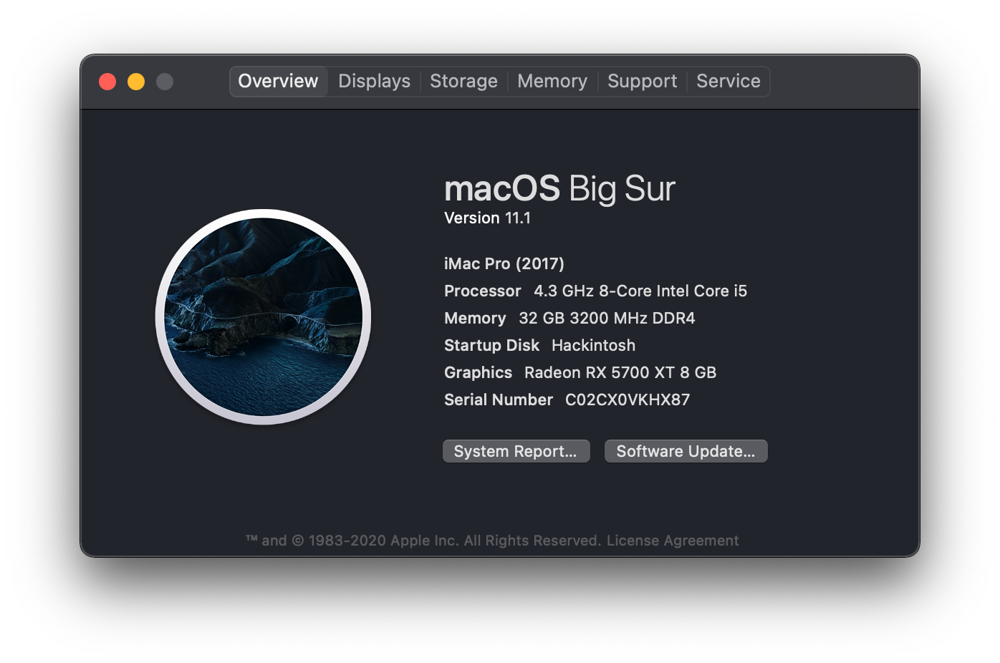

# OpenCore config for X470 Gaming Plus + R7 3700x + 5700XT 

## 1. System configuration details
| Component        | Manufacturer        | Model
| ---------------- | ------------        | -----
| Motherboard      | MSI                 | X470 Gaming Plus
| CPU              | AMD                 | Ryzen 7 3700X
| RAM              | Gskill              | Trident Z RGB 2x16GB cas 14-14-14-34
| VGA              | MSI                 | RX 5700XT Gaming X 8GB
| SSD              | Corsair             | PCIe MP510 240GB (Hackintosh disk)
| SSD              | Samsung             | PM863a 480GB
| HDD              | Toshiba             | DT01ACA100 1TB
| CPU Cooler       | Noctua              | NH-D15 Chromax Black
| PSU              | FSP                 | Hexa 85+ 650w Bronze
## 2. OpenCore component
* OpenCore 0.6.4
* Resources folder has been removed to reduce repo size. If you want to have OpenCore fancy boot menu, just download it from [Resources Folder](https://github.com/acidanthera/OcBinaryData) and add to OC folder (containing Kext, Tools, Driver...)
* Lastest Realtek 8111 kext (2.3.0 atm)  still does not work on this version, 2.2.2 works just fine so just use this 
* the 2 configs in **DeviceProperties > Add** are used to forced the corsair PCIe SSD and the LAN as native/internal device
## 3. Some notes
* Generate your own PlatformInfo using [GenSMBIOS](https://github.com/corpnewt/GenSMBIOS). The hardest task of creating a perfect Hackintosh System may be this one. If you have no way making it works, just call Apple Support and make a wish (I was successful on this) 
